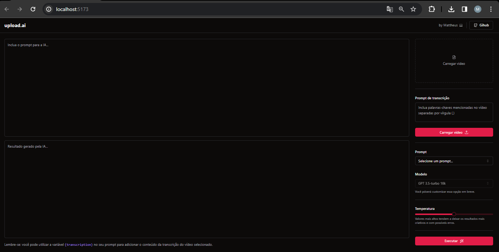

## 💻 Projeto

Aplicação possibilita realizar upload de videos e por meio de IA, criar automaticamente títulos chamativos e descrições com um boa indexação.

## 🚀 Tecnologias

Esse projeto foi desenvolvido com as seguintes tecnologias:

- React
- Node
- Prisma
- Radix e Shadcn ui
- Tailwind
- TypeScript
- Fastify
- Axios
- Zod 
- OpenAI API

## 🚀 Execução

Baixe o repositório front-end e back-end.
Execute em ambos: pnpm install e pnpm run dev

  

